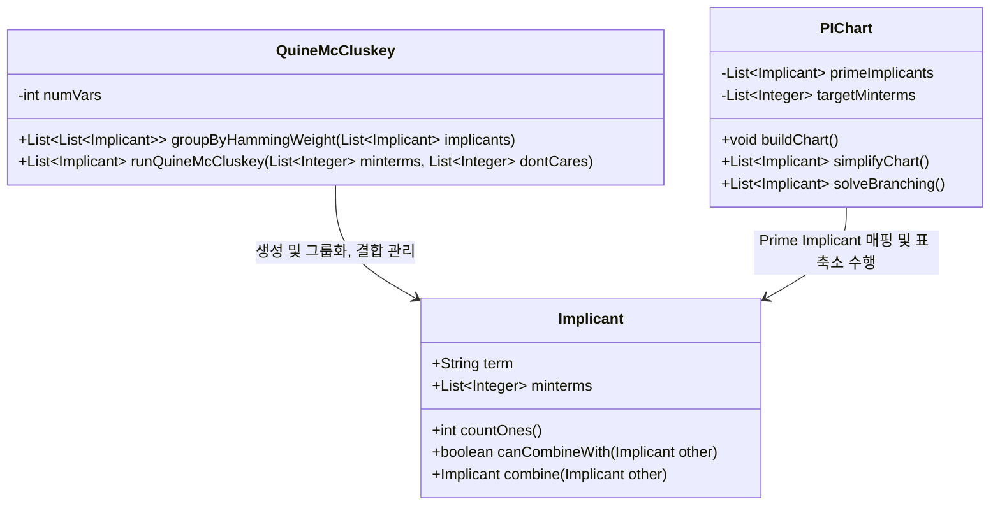

# [Phase 1] Java OOP & String 기반 Tabular Method 자료구조 설계서

이 문서는 대학 논리설계 과제 기준에 부합하며, 비트 연산의 복잡성을 배제하고 **직관적인 문자열(String)과 문자 배열(char[])**을 활용하여 **Quine-McCluskey 및 PI Chart Reduction**을 구현할 수 있도록 돕는 설계서입니다. 팀원들과 공유하여 프로젝트의 기본 뼈대를 수립하는 데 사용합니다.

---

## 1. 전체 아키텍처 개요 (Class Diagram)

프로그램은 역할과 책임에 따라 크게 3가지 핵심 클래스로 분리됩니다.

---

## 2. 클래스별 상세 설계 설명

### 2.1. `Implicant` 클래스 (항의 표현)
이 클래스는 0개 이상의 Minterm이 결합되어 형성된 하나의 항(Term)을 표현합니다.

* **핵심 필드**:
  1. `String term`: 이진법 표현 및 대시 표현 문자열 (예: `"0-10"`, `"1100"`).
  2. `List<Integer> minterms`: 이 항이 커버하는 원래의 minterm 번호 목록 (예: $m_0, m_2$가 결합했다면 `[0, 2]`).

* **핵심 메서드**:
  * `int countOnes()`: `term` 문자열에서 문자 `'1'`의 개수를 루프로 세어 반환합니다. (결합을 위한 그룹 분배에 사용)
  * `boolean canCombineWith(Implicant other)`:
    * 두 `term`의 문자열을 문자 단위로 도는 단일 `for` 루프로 비교합니다.
    * 대시(`-`)의 위치는 완전히 일치해야 하며, 다른 글자(하나는 `'0'`, 하나는 `'1'`)가 **정확히 단 하나**만 존재하는지 검증하여 결과를 리턴합니다.
  * `Implicant combine(Implicant other)`:
    * 두 `Implicant`를 결합하여 다른 한 자리를 `'-'`로 치환한 새로운 `Implicant` 객체를 생성하여 반환합니다.
    * Minterm 리스트는 두 객체의 리스트를 합쳐 오름차순으로 정렬합니다.

---

### 2.2. `QuineMcCluskey` 클래스 (PI 추출 엔진)
Minterm들과 Don't Care들을 그룹화하고 결합하여 최종 Prime Implicant(PI) 목록을 뽑아내는 통제 모듈입니다.

* **핵심 메서드**:
  * `List<List<Implicant>> groupByHammingWeight(List<Implicant> implicants)`:
    * 입력된 `Implicant` 리스트를 1의 개수에 따라 분류하여 반환합니다.
    * 총 $N+1$개의 그룹 리스트를 생성하여 각 임플리컨트를 분배합니다.
  * `List<Implicant> runQuineMcCluskey(List<Integer> minterms, List<Integer> dontCares)`:
    * Column 0부터 시작하여, 인접 그룹 간 이중 `for` 루프로 `canCombineWith`를 호출하며 다음 Column의 병합 항들을 만들어 냅니다.
    * 더 이상 병합되지 않고 남은(결합에 사용되지 않은) 항들을 수집하여 최종 **Prime Implicants (PI)** 리스트로 반환합니다.

---

### 2.3. `PIChart` 클래스 (표 축소 및 SOP 최적화)
Don't care를 제외한 진짜 Minterm들(Columns)과 추출된 Prime Implicants(Rows) 간의 관계를 관리하고 축소하는 클래스입니다.

* **핵심 필드**:
  - `List<Implicant> primeImplicants`: 행(Row) 정보
  - `List<Integer> targetMinterms`: 열(Column) 정보 (**※ Don't care는 절대 포함되지 않음**)
  - `boolean[][] chart` 또는 `Map<Implicant, Set<Integer>>`: 임플리컨트가 특정 Minterm을 커버하는지 매핑하는 데이터 구조.

* **핵심 메서드**:
  1. `simplifyChart()` (단순 표 축소):
     * **EPI 추출**: 단 하나의 PI에 의해서만 커버되는 Minterm 열을 찾아 필수 주임플리컨트(EPI)로 선정하고 해당 행/열을 표에서 지웁니다.
     * **행 지배(Row Domination)**: 더 많은 Minterm을 커버하는 행이 열세인 행을 지배하므로, 피지배 행을 삭제합니다.
     * **열 지배(Column Domination)**: 깐깐하게 커버되는 열이 있을 때, 이를 포함하여 쉽게 커버되는 열(지배 열)을 삭제합니다.
  2. `solveBranching()` (순환 관계 완전 탐색):
     * 표가 더 이상 줄어들지 않을 때(Cyclic Table), 특정 PI를 선택하는 분기와 배제하는 분기로 쪼개어 **Branch-and-Bound(재귀 탐색)**로 리터럴 수와 항 개수가 최소인 해를 찾습니다.
