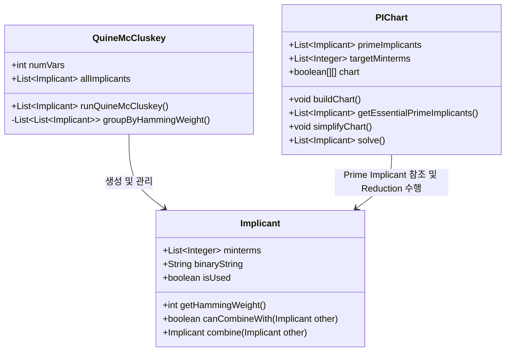

# [Phase 1] Java OOP 기반 Tabular Method 자료구조 설계서

이 문서는 사용자가 Java의 객체 지향 설계를 극대화하여 **Quine-McCluskey 및 PI Chart Reduction**을 우아하게 구현할 수 있도록 돕는 설계 설계도입니다. (교수님의 의도를 100% 만족하는 순수 OOP 구조 설계)

---

## 1. 전체 아키텍처 개요 (Class Diagram Outline)

프로그램은 역할과 책임에 따라 크게 3가지 핵심 클래스로 분리됩니다.

---

## 2. 클래스별 상세 설계 설명 (의사코드 형식)

### 2.1. `Implicant` 클래스 (항의 표현)
이 클래스는 0개 이상의 Minterm이 결합되어 형성된 하나의 항(Term)을 표현합니다.

* **핵심 필드**:
  1. `List<Integer> minterms`: 이 항이 커버하는 원래의 minterm 번호 목록 (예: $m_0, m_2$가 결합했다면 `[0, 2]`).
  2. `String binaryString`: 이진법 표현 및 대시 표현 (예: `"0-10"`).
  3. `boolean isUsed`: 다음 단계 결합에 사용되었는지 여부를 체크하는 플래그 (체크되지 않은 항이 최종 **Prime Implicant(PI)**가 됨).

* **핵심 메서드 설계**:
  * `int getHammingWeight()`: `binaryString`에서 `'1'`의 개수를 세어 반환합니다. (결합 그룹 형성에 사용)
  * `boolean canCombineWith(Implicant other)`:
    * 두 항의 대시(`-`) 위치가 정확히 일치하는지 확인합니다.
    * 대시 위치가 일치하면서, 단 하나의 자릿수만 서로 다른지(하나는 `0`, 하나는 `1`) 검증하여 결합 가능 여부를 `boolean`으로 리턴합니다.
  * `Implicant combine(Implicant other)`:
    * 두 `Implicant`를 결합하여 대시(`-`)가 추가된 새로운 `Implicant` 객체를 생성하고 리턴합니다.
    * 이때 새로운 객체의 `minterms` 목록은 두 객체의 `minterms` 리스트가 합쳐진 형태가 됩니다. (예: `[0, 2]`와 `[8, 10]`이 합쳐지면 `[0, 2, 8, 10]`).

---

### 2.2. `QuineMcCluskey` 클래스 (PI 추출 엔진)
Minterm들과 Don't Care들을 그룹화하고 결합하여 최종 Prime Implicant(PI) 목록을 뽑아내는 통제 모듈입니다.

* **핵심 알고리즘 흐름**:
  1. **초기화**: 입력된 모든 Minterm과 Don't Care 항들을 각각 `Implicant` 객체로 생성합니다.
  2. **그룹화 (`groupByHammingWeight`)**: 1의 개수(Hamming Weight)에 따라 `List<List<Implicant>>` 구조로 임플리컨트들을 분할합니다.
  3. **결합 반복 루프**:
     * $i$번째 그룹의 모든 항과 $i+1$번째 그룹의 모든 항들을 서로 `canCombineWith`로 비교합니다.
     * 결합이 가능하다면 `combine` 메서드를 호출해 새 객체를 만들고 다음 차수(Column)의 리스트에 추가합니다. 결합에 참여한 항들의 `isUsed` 플래그는 `true`로 설정합니다.
     * 더 이상 어떤 항도 결합할 수 없을 때까지 이 과정을 반복합니다.
  4. **PI 수집**: 반복이 끝난 후, 모든 차수에서 `isUsed == false`로 남아있는 항들만 필터링하면 그것이 바로 **Prime Implicants (PI)**가 됩니다.

---

### 2.3. `PIChart` 클래스 (표 축소 및 SOP 최적화)
Don't care를 제외하고 진짜 커버해야 할 Minterm들(Columns)과 추출된 Prime Implicants(Rows) 간의 관계를 도식화하고 축소하는 클래스입니다.

* **핵심 필드**:
  - `List<Implicant> primeImplicants`: 행(Row) 정보
  - `List<Integer> targetMinterms`: 열(Column) 정보 (**※ Don't care는 여기에 절대 포함되면 안 됩니다!**)
  - `boolean[][] chart` 또는 `Map<Implicant, Set<Integer>>`: 임플리컨트가 특정 Minterm을 커버하는지 여부를 기록하는 표.

* **핵심 메서드 및 Reduction 논리**:
  1. **`buildChart()`**: `primeImplicants` 내의 `minterms`가 `targetMinterms`에 포함되는지 확인하여 표를 채웁니다.
  2. **`getEssentialPrimeImplicants()` (필수 주임플리컨트 추출)**:
     * 특정 Minterm 열(Column)에 체크가 딱 하나만 되어 있는 열을 찾습니다.
     * 그 열을 커버하는 유일한 PI가 바로 **EPI(Essential Prime Implicant)**입니다.
     * 발견된 EPI는 최종 SOP식에 무조건 포함되며, 해당 EPI가 커버하는 모든 Minterm 열들과 해당 EPI 행을 표에서 지웁니다.
  3. **`simplifyChart()` (행/열 지배 적용)**:
     * **열 지배(Column Domination)**: 더 좁은 범위의 PI로만 커버되는 깐깐한 열(Column)이 있다면, 더 넓은 범위로 커버되는 느슨한 열(지배 열)을 제거합니다. (어차피 깐깐한 놈을 커버하려다 보면 느슨한 놈은 자동으로 커버되기 때문)
     * **행 지배(Row Domination)**: 더 많은 Minterm을 커버하는 우수한 행이 열세인 행을 지배하므로, 피지배 행을 표에서 삭제합니다.
  4. **`solve()`**:
     * EPI 제거 $\rightarrow$ Row/Col Domination $\rightarrow$ 다시 EPI 제거 과정을 표가 더 이상 줄어들지 않을 때까지 반복(Loop)하여 최종 최소 식을 도출합니다.

---

## 3. 예외 케이스 및 검증 논리

* **Don't Care 처리 규칙**: Don't Care는 `QuineMcCluskey`의 결합 과정에서는 다른 Minterm들과 똑같이 참여하여 PI를 형성하지만, `PIChart`의 열(Column)을 구성할 때는 **완전히 배제**되어야 합니다. (Don't care는 굳이 커버하지 않아도 되는 영역이기 때문)
* **결합 중복 제거**: 결합 시 동일한 Minterm들을 커버하는 임플리컨트가 여러 번 생성될 수 있습니다(예: $m_{0,1,2,3}$ 결합 시 순서에 따라 중복 생성). `Set` 또는 `binaryString` 비교를 통해 중복 객체를 항상 걸러내야 합니다.
