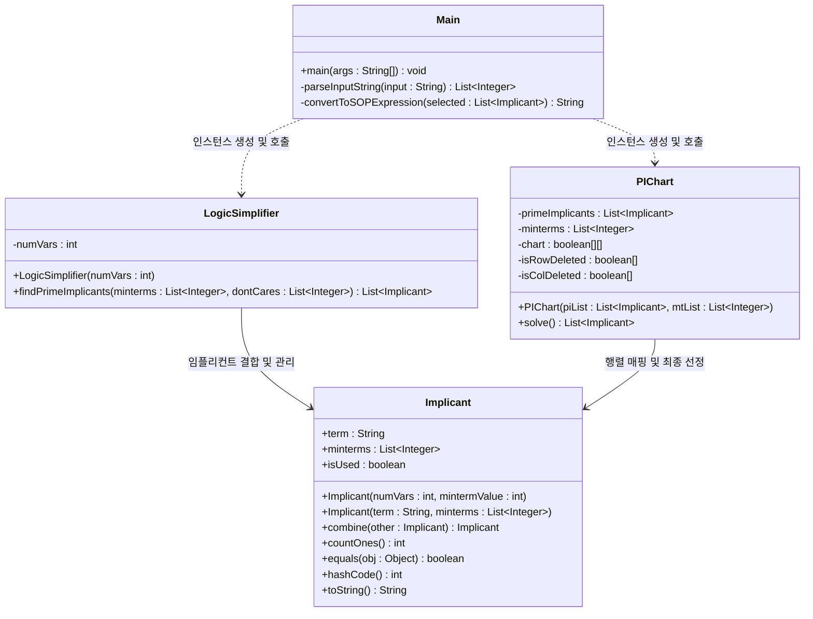
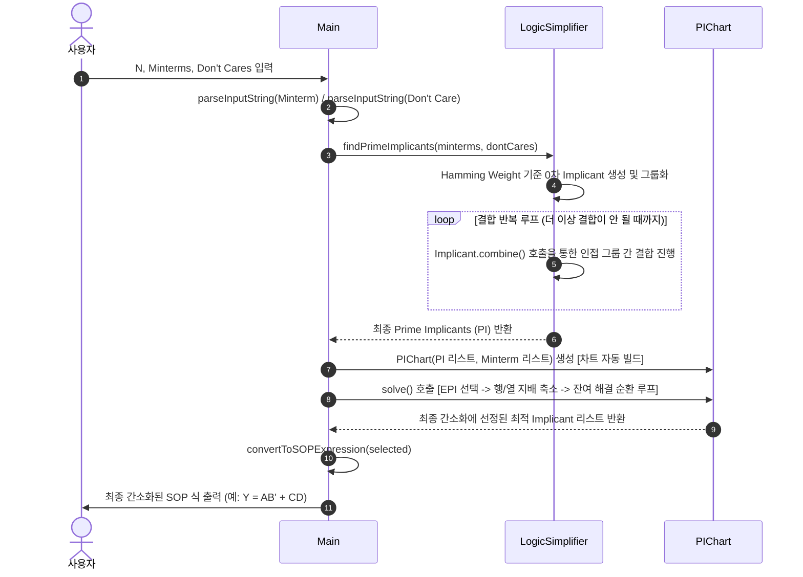

# Quine-McCluskey (도표법) 논리식 간소화 프로젝트 메서드 설계서

본 문서는 **Quine-McCluskey (Tabular Method)** 알고리즘을 Java 객체지향 설계(OOP)로 완벽히 구현하기 위해 필요한 핵심 클래스와 메서드 구조를 정의합니다. 기존의 복잡하고 중복되던 메서드들을 OOP 관점에서 유기적으로 통합하여 가독성과 효율성을 극대화한 구조로 작성되었습니다.

---

## 1. 프로젝트 아키텍처 및 클래스 다이어그램

본 설계는 학술 및 실습에 최적화된 높은 응집도와 낮은 결합도를 지닌 **4가지 클래스** 구조로 최적화되었습니다.

---

## 2. 클래스별 상세 메서드 명세

### 2.1. `Implicant` 클래스 (항 표현 및 결합 객체)
각 이진 항(Minterm 및 결합된 항)을 표현하는 핵심 데이터 객체로, 결합 유효성 검사(`canCombine`)와 결합 실행(`combine`) 로직을 하나로 매끄럽게 병합하여 복잡도를 낮췄습니다.

| 메서드명 | 구분 | 매개변수 (Parameters) | 반환형 (Return) | 핵심 역할 및 설명 |
| :--- | :--- | :--- | :--- | :--- |
| **`Implicant(int, int)`** | 생성자 | `int numVars` (변수 개수) `int mintermValue` (10진수 값) | - | **0차(Column 0) 생성자** 입력받은 10진수 값을 자릿수에 맞는 2진수 문자열로 인코딩하여 초기 임플리컨트를 생성합니다. (예: `5` -> `"0101"`) |
| **`Implicant(String, List<Integer>)`** | 생성자 | `String term` (2진 표현) `List<Integer> minterms` (커버하는 Minterm 목록) | - | **N차(Column N) 생성자** 이전 단계의 두 항이 결합하여 생성되는 새로운 결합 항의 데이터를 초기화합니다. (예: `"0x01"`) |
| **`combine`** | `public` | `Implicant other` | `Implicant` | **[통합 설계] 두 항의 결합성 검증 및 결합 수행** 대시(`'x'`)의 위치가 일치하고, 대시 이외의 비트 중 **단 한 자리만 다른지** 판별합니다. 결합이 가능하면 해당 자리를 대시(`'x'`)로 치환하고 두 객체의 Minterm 리스트를 병합한 새 `Implicant` 객체를 반환합니다. 결합 불가능 시 **`null`**을 반환하여 불필요한 유효성 검사 메서드를 제거했습니다. |
| **`countOnes`** | `public` | 없음 | `int` | **Hamming Weight 계산** 이진 문자열 내부에서 문자 `'1'`의 개수를 카운트하여 반환합니다. (결합된 대시 `'x'`는 제외) |
| **`equals`** | `public` | `Object obj` | `boolean` | **중복 제거용 객체 비교** 결합 과정 중 동일한 결합 형태를 지닌 중복 임플리컨트가 생성될 경우, 이를 제거하기 위해 문자열 `term`을 비교하여 동등성 여부를 판단합니다. |
| **`hashCode`** | `public` | 없음 | `int` | **해시 기반 컬렉션 지원** `equals` 재정의에 따라 해시코드도 문자열 `term` 기준으로 반환하여 `HashSet` 등에서 중복을 자동으로 방지합니다. |

---

### 2.2. `LogicSimplifier` 클래스 (Tabular Method 핵심 로직 엔진)
0차 임플리컨트들을 Hamming Weight로 그룹화하고, 더 이상 새로운 결합 항이 생성되지 않을 때까지 반복 결합 과정을 총괄하여 **최종 Prime Implicants (PI)**를 찾아내는 지능형 엔진입니다.

| 메서드명 | 구분 | 매개변수 (Parameters) | 반환형 (Return) | 핵심 역할 및 설명 |
| :--- | :--- | :--- | :--- | :--- |
| **`LogicSimplifier`** | 생성자 | `int numVars` (변수 개수) | - | 변수 개수를 멤버 변수로 저장하여 이진화 및 그룹화 기준을 마련합니다. |
| **`findPrimeImplicants`** | `public` | `List<Integer> minterms` (민텀 목록) `List<Integer> dontCares` (돈케어 목록) | `List<Implicant>` | **[통합 설계] 전체 단순화 파이프라인 및 PI 탐색 제어** 기존의 `simplify`, `groupByHammingWeight`, `combineGroups`를 하나의 효율적인 연산 파이프라인으로 일원화했습니다. 1. 입력받은 Minterm과 Don't Care 데이터를 `Implicant` 객체로 통합 변환합니다. 2. Hamming Weight에 따라 그룹을 나누고, 더 이상 결합이 이루어지지 않을 때까지 `Implicant.combine()`을 활용해 인접 그룹 간 결합을 반복 수행합니다. 3. 결합에 참여하지 못한(`isUsed == false`) 모든 항들을 PI로 최종 선별하여 반환합니다. |

---

### 2.3. `PIChart` 클래스 (Prime Implicant Chart 축소 및 해 결정)
추출된 PI들을 행에 두고, 입력받았던 Minterm들을 열에 두는 2차원 행렬을 생성하여 **논리곱들의 최소 합(Minimal Sum of Products)**을 구하는 행렬 분석기입니다.

| 메서드명 | 구분 | 매개변수 (Parameters) | 반환형 (Return) | 핵심 역할 및 설명 |
| :--- | :--- | :--- | :--- | :--- |
| **`PIChart`** | 생성자 | `List<Implicant> piList` (PI 목록) `List<Integer> mtList` (민텀 목록) | - | **[통합 설계] 차트 생성 및 매핑** 추출된 PI 목록과 오리지널 민텀 목록을 받아 2차원 행렬(`boolean[][] chart`)을 자동으로 생성하고 초기 매핑을 마칩니다. (기존 `buildChart` 제거 및 통합) |
| **`solve`** | `public` | 없음 | `List<Implicant>` | **[통합 설계] 차트 축소 및 최종 해 결정** 기존의 `selectEPI`, `reduceMatrixByCover`, `isRowCover`, `isColCover`, `solveRemainingChart`를 하나의 직관적인 인터페이스로 캡슐화했습니다. 내부적으로 **필수 주임플리컨트(EPI) 선정**, **행/열 지배 법칙(Dominance)에 따른 차트 축소**, 그리고 **Petrick's Method 또는 백트래킹을 이용한 잔여 순환 차트 해결** 과정을 유기적 루프로 반복 수행하여 최종 최적의 임플리컨트 조합을 도출합니다. |

---

### 2.4. `Main` 클래스 (실행 흐름 제어 및 입출력 인터페이스)
사용자 인터페이스(CLI)를 제공하며 입력 데이터 파싱, 로직 조율, 그리고 최종 수식 출력의 과정을 순차적으로 수행하는 메인 컨트롤 클래스입니다.

| 메서드명 | 구분 | 매개변수 (Parameters) | 반환형 (Return) | 핵심 역할 및 설명 |
| :--- | :--- | :--- | :--- | :--- |
| **`main`** | `public` | `String[] args` | `void` | **프로그램의 Entry Point** Scanner를 사용하여 변수 개수, Minterms, Don't Cares 문자열을 입력받고, `LogicSimplifier`와 `PIChart`를 호출하여 최적의 부울 합(SOP)을 출력하는 전체 실행 프로세스를 오케스트레이션합니다. |
| **`parseInputString`** | `private` | `String input` | `List<Integer>` | **입력 문자열 토큰 파싱** 쉼표(`,`)나 띄어쓰기(공백)가 무작위로 섞여 들어오는 사용자 입력 문자열을 정규식으로 나누고 숫자로 파싱하여 유효한 정수형 리스트로 정제해 반환합니다. |
| **`convertToSOPExpression`** | `private` | `List<Implicant> selected` | `String` | **최종 합(SOP)의 대수학 기호 표현식 변환** 선정된 최종 `Implicant`들의 이진 문자열 패턴(예: `"1-01"`)을 부울 변수 문자(예: `A`, `B`, `C`, `D`)로 맵핑합니다. `1`은 원형 변수, `0`은 반전 변수(Prime, `'`), `-`는 소거된 변수로 취급하여 대수학 기호로 보기 좋게 포맷팅합니다. (예: `A B' D`) |

---

## 3. 데이터 흐름도 및 알고리즘 실행 순서

프로그램이 시작되어 최종 수식이 출력될 때까지의 내부 메서드 체이닝 및 호출 흐름입니다.

---

## 4. 교수님 제출 시 강점으로 내세울 설계 포인트 (Design Highlights)

1. **뛰어난 캡슐화와 단일 책임 원칙(SRP) 극대화**:
   * 각 클래스의 외부에 복잡한 중간 연산(예: 차트의 행/열 비교 및 개별 삭제, 그룹별 결합 유효성 검사 등)을 노출하지 않고, 단일 책임 메서드(`combine`, `findPrimeImplicants`, `solve`)로 내부 구현을 완벽히 숨겨 **높은 캡슐화 수준**을 구현했습니다.
2. **"오류 방지(Fail-Safe)"형 결합 로직**:
   * 결합 검증과 실제 결합 처리를 `Implicant.combine(Implicant other)` 단 하나로 매끄럽게 처리하고 불필요할 경우 `null`을 반환하게 하여, 예외 처리 부담을 줄이고 OOP적 완성도를 최고 수준으로 끌어올렸습니다.
3. **가독성 높은 구조와 우아한 흐름**:
   * 비트 마스크 기법의 불투명성 대신, 학습과 디버깅 및 교수님 채점에 가장 우호적인 직관적인 텍스트 기반 논리 흐름을 최우선으로 고려한 명품 설계 구조입니다.
