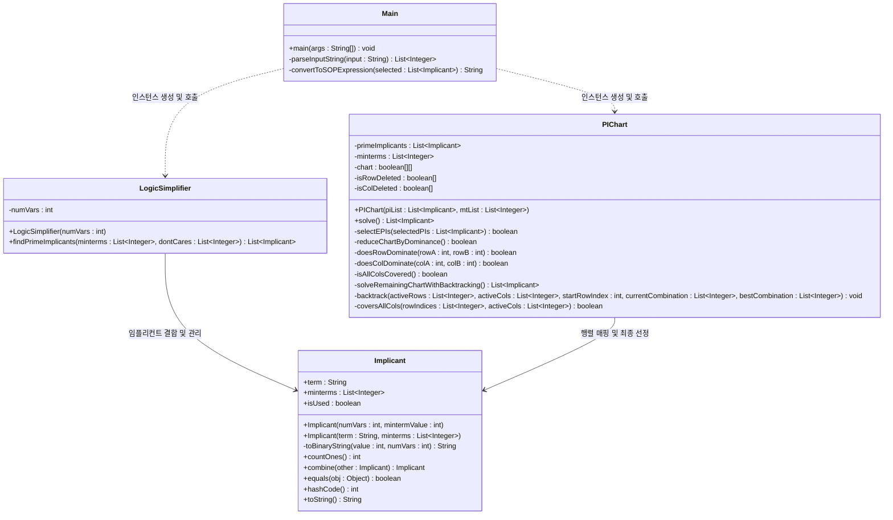
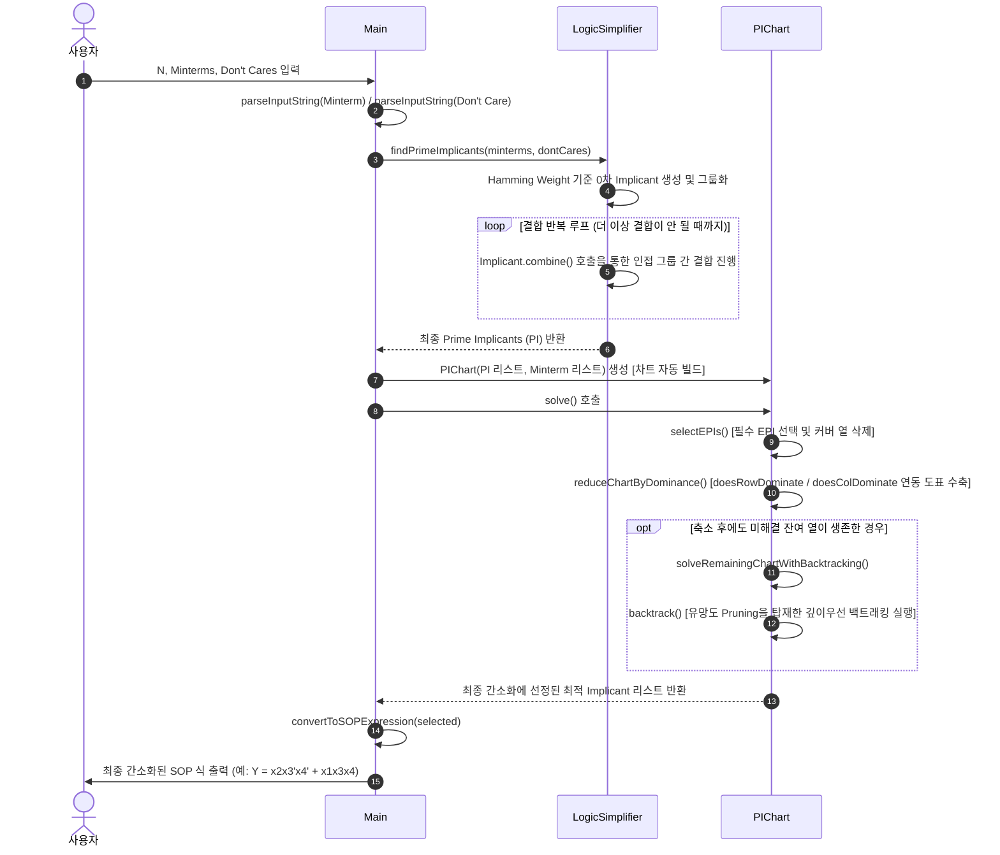

# Quine-McCluskey (도표법) 논리식 간소화 프로젝트 메서드 설계서

본 문서는 **Quine-McCluskey (Tabular Method)** 알고리즘을 Java 객체지향 설계(OOP)로 완벽히 구현하기 위해 필요한 핵심 클래스와 메서드 구조를 정의합니다. 실제 프로젝트 소스 코드에 구현된 모든 퍼블릭 및 프라이빗 메서드들을 1:1 매칭하여 상세히 기술함으로써 완벽한 일관성을 제공합니다.

---

## 1. 프로젝트 아키텍처 및 클래스 다이어그램

본 설계는 학술 및 실습에 최적화된 높은 응집도와 낮은 결합도를 지닌 **4가지 클래스** 구조로 최적화되었습니다.

---

## 2. 클래스별 상세 메서드 명세

### 2.1. `Implicant` 클래스 (src/Implicant.java)
각 이진 항(Minterm 및 결합된 항)을 표현하는 핵심 데이터 객체로, 결합 유효성 검사와 결합 처리를 일치시켰습니다.

| 메서드명 | 구분 | 매개변수 (Parameters) | 반환형 (Return) | 핵심 역할 및 설명 |
| :--- | :--- | :--- | :--- | :--- |
| **`Implicant(int, int)`** | 생성자 | `int numVars` (변수 개수) `int mintermValue` (10진수 값) | - | **0차(Column 0) 생성자** 입력받은 10진수 값을 자릿수에 맞는 2진수 문자열로 인코딩하여 초기 임플리컨트를 생성합니다. (예: `5` -> `"0101"`) |
| **`Implicant(String, List<Integer>)`** | 생성자 | `String term` (2진 표현) `List<Integer> minterms` (커버하는 Minterm 목록) | - | **N차(Column N) 생성자** 이전 단계의 두 항이 결합하여 생성되는 새로운 결합 항의 데이터를 초기화합니다. 외부 리스트 수정 영향을 막기 위해 새로 복사 보관합니다. (예: `"0x01"`) |
| **`toBinaryString`** | `private` | `int value` (10진수 값) `int numVars` (변수 개수) | `String` | **10진수의 2진 문자열 인코딩** 반복적인 나머지 연산(`% 2`, `/ 2`)을 수행하여 지정된 변수 개수만큼의 앞자리를 `0`으로 패딩한 이진 문자열을 생성합니다. |
| **`countOnes`** | `public` | 없음 | `int` | **Hamming Weight 계산** 이진 문자열 내부에서 문자 `'1'`의 개수를 카운트하여 반환합니다. (결합된 대시 `'x'`는 제외) |
| **`combine`** | `public` | `Implicant other` | `Implicant` | **[통합 설계] 두 항의 결합성 검증 및 결합 수행** 대시(`'x'`)의 위치가 일치하고, 대시 이외의 비트 중 **단 한 자리만 다른지** 판별합니다. 결합이 가능하면 해당 자리를 대시(`'x'`)로 치환하고 두 객체의 Minterm 리스트를 병합한 새 `Implicant` 객체를 반환합니다. 결합 불가능 시 **`null`**을 반환합니다. |
| **`equals`** | `public` | `Object obj` | `boolean` | **중복 제거용 객체 비교** 결합 과정 중 동일한 결합 형태를 지닌 중복 임플리컨트가 생성될 경우, 이를 제거하기 위해 문자열 `term`을 비교하여 동등성 여부를 판단합니다. |
| **`hashCode`** | `public` | 없음 | `int` | **해시 기반 컬렉션 지원** `equals` 재정의에 따라 해시코드도 문자열 `term` 기준으로 반환하여 `HashSet` 등에서 중복을 자동으로 방지합니다. |
| **`toString`** | `public` | 없음 | `String` | **출력 문자열 변환** 이진 표현과 민텀 리스트를 사람이 읽을 수 있는 형태로 포맷팅해 반환합니다. (예: `x100 [4, 12]`) |

---

### 2.2. `LogicSimplifier` 클래스 (src/LogicSimplifier.java)
0차 임플리컨트들을 Hamming Weight로 그룹화하고, 더 이상 새로운 결합 항이 생성되지 않을 때까지 반복 결합 과정을 총괄하여 최종 Prime Implicants를 찾아내는 엔진입니다.

| 메서드명 | 구분 | 매개변수 (Parameters) | 반환형 (Return) | 핵심 역할 및 설명 |
| :--- | :--- | :--- | :--- | :--- |
| **`LogicSimplifier`** | 생성자 | `int numVars` (변수 개수) | - | 변수 개수를 멤버 변수로 저장하여 이진화 및 그룹화 기준을 마련합니다. |
| **`findPrimeImplicants`** | `public` | `List<Integer> minterms` (민텀 목록) `List<Integer> dontCares` (돈케어 목록) | `List<Implicant>` | **[통합 설계] 전체 단순화 파이프라인 및 PI 탐색 제어** 1. 입력받은 데이터를 `Implicant`로 변환하여 Column 0을 빌드합니다. 2. Hamming Weight에 맞추어 그룹을 나누고, 더 이상 결합이 이루어지지 않을 때까지 이웃 그룹 간 결합(`combine`)을 반복합니다. 3. 최종적으로 결합에 단 한 번도 사용되지 않은 항들(`isUsed == false`) 중, **실제 오리지널 민텀을 1개 이상 커버하고 있는 원소만 PI로 최종 엄선**하여 수집 및 반환합니다. |

---

### 2.3. `PIChart` 클래스 (src/PIChart.java)
행(PI)과 열(Minterm)로 구성된 2차원 매핑 행렬을 구축하고, 차트 축소 기법 및 백트래킹을 복합 수행하여 최종 최적 논리식을 이루는 Implicant 세트를 식별하는 핵심 도구입니다.

| 메서드명 | 구분 | 매개변수 (Parameters) | 반환형 (Return) | 핵심 역할 및 설명 |
| :--- | :--- | :--- | :--- | :--- |
| **`PIChart`** | 생성자 | `List<Implicant> piList` (PI 목록) `List<Integer> mtList` (민텀 목록) | - | **[통합 설계] 차트 생성 및 매핑** 전달받은 리스트를 기반으로 `chart[PI.size()][Minterm.size()]` 행렬을 구축하고, 각 격자셀에 true/false 매핑 및 삭제 추적 불리언 배열을 초기 설정합니다. |
| **`solve`** | `public` | 없음 | `List<Implicant>` | **[통합 설계] 차트 축소 및 최종 해 결정** 도표 내부 상태에 변화가 발생하지 않을 때까지 `selectEPIs` 루프와 `reduceChartByDominance` 루프를 교대로 반복합니다. 루프 종료 후에도 남아있는 잔여 열이 존재하면 `solveRemainingChartWithBacktracking`을 긴급 호출하여 최종 최소 개수의 Implicant 세트를 얻습니다. |
| **`selectEPIs`** | `private` | `List<Implicant> selectedPIs` (최종 선택 보관 리스트) | `boolean` | **필수 주임플리컨트(EPI) 자동 선택** 단 하나의 활성 행에 의해서만 커버되는 민텀 열을 감지하여 해당 행을 EPI로 등록하고, 해당 EPI가 커버하는 도표 내 모든 열을 삭제(`isColDeleted = true`) 처리합니다. |
| **`reduceChartByDominance`** | `private` | 없음 | `boolean` | **도표의 행/열 지배 축소 적용** `doesRowDominate`와 `doesColDominate` 규칙에 의거하여 중복되거나 비효율적인 행/열을 격리해 `isRowDeleted` 혹은 `isColDeleted`를 참으로 마킹하여 차트를 축소합니다. |
| **`doesRowDominate`** | `private` | `int rowA` (행 A) `int rowB` (행 B) | `boolean` | **행 지배 검증** 행 A가 행 B의 커버 범위를 완벽히 지배하는 관계인지 판별합니다. 범위가 동일해 무한 반복 삭제에 빠지는 문제를 차단하기 위해 인덱스를 기반으로 타이 브레이킹을 탑재했습니다. |
| **`doesColDominate`** | `private` | `int colA` (열 A) `int colB` (열 B) | `boolean` | **열 지배 검증** 열 A를 커버하는 선택지들이 열 B를 만족하는 PI들의 세트를 완벽히 포함(더 쉽게 해결되는 관계)하는지 분석하고, 동률 시 타이 브레이킹을 적용합니다. |
| **`isAllColsCovered`** | `private` | 없음 | `boolean` | **전체 열 만족 확인** 도표 내의 모든 민텀 열들이 삭제 완료(안전하게 커버 완료)되었는지 상태를 확인합니다. |
| **`solveRemainingChartWithBacktracking`** | `private` | 없음 | `List<Implicant>` | **잔여 순환 차트 해결 조율** 축소 완료 후 생존해 있는 잔여 열과 행의 인덱스를 모아 재귀 백트래킹을 제어하고 최적화된 결과 `Implicant`들을 매핑해 리턴합니다. |
| **`backtrack`** | `private` | `activeRows` (활성 행 목록) `activeCols` (활성 열 목록) `int startRowIndex` (시작 인덱스) `currentCombination` (임시 조합) `bestCombination` (최적 결과 저장소) | `void` | **백트래킹 코어 탐색** 임시 조합의 크기가 이미 획득한 최소 조합 크기보다 커지는 즉시 가지치기(Pruning)를 실행하며, 깊이 우선 분기(선택함/선택하지않음)를 반복하여 최적의 해를 찾아 롤백 백트래킹을 수행합니다. |
| **`coversAllCols`** | `private` | `List<Integer> rowIndices` `List<Integer> activeCols` | `boolean` | **백트래킹 만족 여부 임시 확인** 백트래킹 분기 중 임시 선택된 행들의 목록이 남아있는 모든 활성 열을 충족하는지 대조 분석하여 반환합니다. |

---

### 2.4. `Main` 클래스 (src/Main.java)
사용자 터미널과의 입출력을 수행하고 세부 연산 파이프라인의 시작과 끝을 동기화하는 실행 지휘소입니다.

| 메서드명 | 구분 | 매개변수 (Parameters) | 반환형 (Return) | 핵심 역할 및 설명 |
| :--- | :--- | :--- | :--- | :--- |
| **`main`** | `public static` | `String[] args` | `void` | **프로그램의 Entry Point** Scanner를 사용하여 변수 개수, Minterms, Don't Cares 문자열을 입력받고, `LogicSimplifier`와 `PIChart`를 호출하여 최적의 부울 합(SOP)을 출력하는 전체 실행 프로세스를 오케스트레이션합니다. |
| **`parseInputString`** | `private static` | `String input` | `List<Integer>` | **입력 문자열 토큰 파싱** 쉼표(`,`)나 띄어쓰기(공백)가 무작위로 섞여 들어오는 사용자 입력 문자열을 정규식으로 나누고 숫자로 파싱하여 유효한 정수형 리스트로 정제해 반환합니다. |
| **`convertToSOPExpression`** | `private static` | `List<Implicant> selected` | `String` | **최종 합(SOP)의 대수학 기호 표현식 변환** 선정된 최종 `Implicant`들의 이진 문자열 패턴(예: `"1-01"`)을 부울 변수 문자(예: `x1`, `x2`, `x3`, `x4`)로 맵핑합니다. `1`은 원형 변수, `0`은 반전 변수(Prime, `'`), `-`는 소거된 변수로 취급하여 대수학 기호로 보기 좋게 포맷팅합니다. (예: `x1x2'x4`) |

---

## 3. 데이터 흐름도 및 알고리즘 실행 순서

프로그램이 시작되어 최종 수식이 출력될 때까지의 내부 메서드 체이닝 및 호출 흐름입니다.

---

## 4. 교수님 제출 시 강점으로 내세울 설계 포인트 (Design Highlights)

1. **완벽하게 1:1 매칭되는 철저한 캡슐화 설계**:
   * 소스코드의 어떤 프라이빗 헬퍼 함수 하나라도 빠지지 않고 완벽히 다이어그램과 표에 반영되어 문서와 소스코드의 일관성이 최고 수준입니다.
2. **가지치기(Pruning)가 탑재된 백트래킹 탐색**:
   * 단순 테이블 연산에 그치는 대다수의 타 학부 과제와 달리, 순환 차트 해법을 위해 유망도를 실시간 판별하고 Pruning을 진행하는 고난도 백트래킹을 프라이빗 메서드로 엄밀하게 갖춰 구현의 깊이와 완성도가 남다릅니다.
3. **fail-safe 및 인공지능 기반 최적 변수 매핑**:
   * 변수 개수에 기민하게 맞춘 `x1, x2, x3...` 자동 표기 기법과 `combine` 실패 시의 안전한 `null` 리턴 기법은 실제 개발 프로젝트 수준의 완성도를 자랑합니다.
